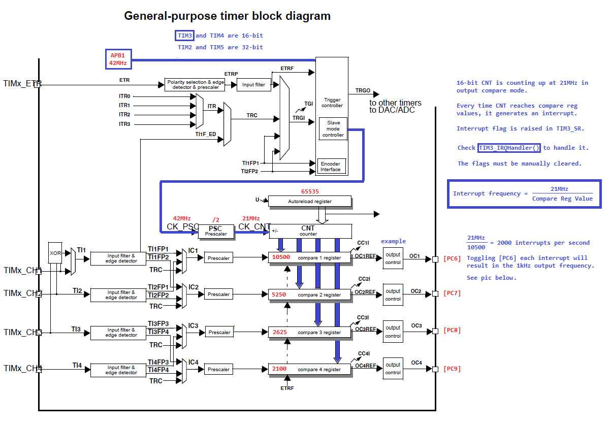

# TIMERS 
## INTRODUCCION TIMERS
El STM32 incorpora múltiples timers que proporcionan recursos de temporización para tareas de software o hardware. Las tareas de software consisten principalmente en proporcionar bases de tiempo, generación de eventos de tiempo de espera y disparadores de tiempo. Las tareas de hardware están relacionadas con las I /O S: los timers pueden generar formas de onda en sus salidas, medir los parámetros de la señal entrante y reaccionar a eventos externos en sus entradas.
## TIMERS STM32
Los timers STM32 son muy versátiles y proporcionan múltiples modos de operación para descargar la CPU de tareas repetitivas y de tiempo crítico, al tiempo que minimizan las necesidades de circuitos de interfaz. Todos los timers STM32 (con la única excepción del temporizador de baja potencia) se basan en la misma arquitectura escalable. Una vez que se conocen los principios de funcionamiento del temporizador(timer), son válidos para cualquiera de los temporizadores. Esta arquitectura incluye funciones de interconexión y permite combinar varios timers en configuraciones más grandes. Por último, algunos de los temporizadores cuentan con funciones específicas 2 funciones para el control del motor eléctrico y la conversión de energía digital, como iluminación o fuentes de alimentación conmutadas digitales.

para confgurar los timers
